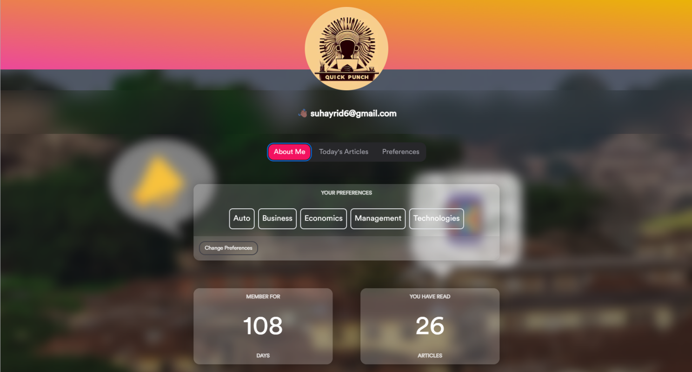
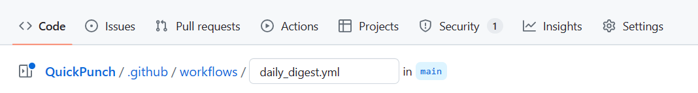
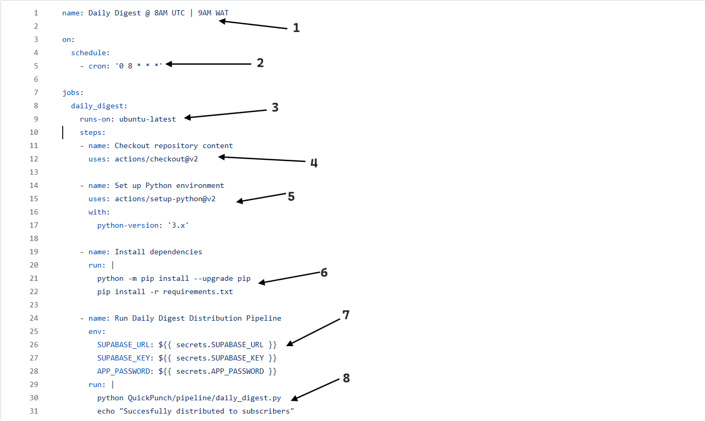
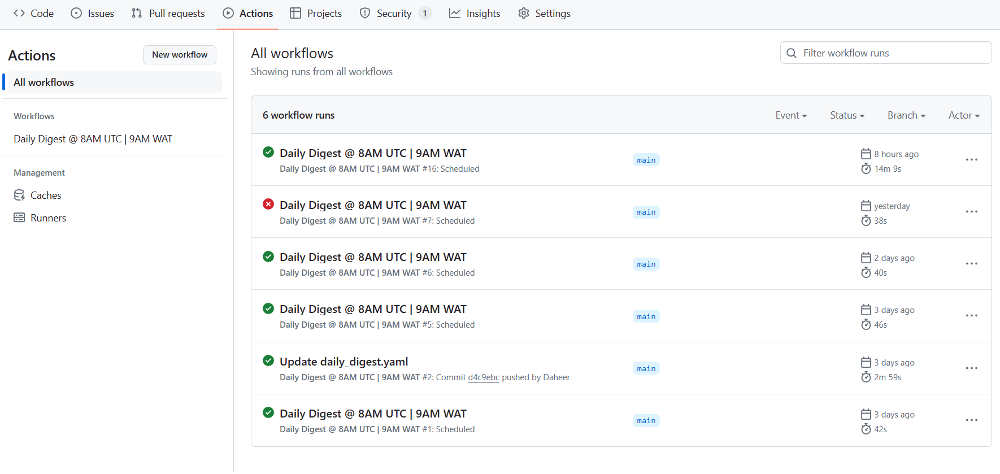
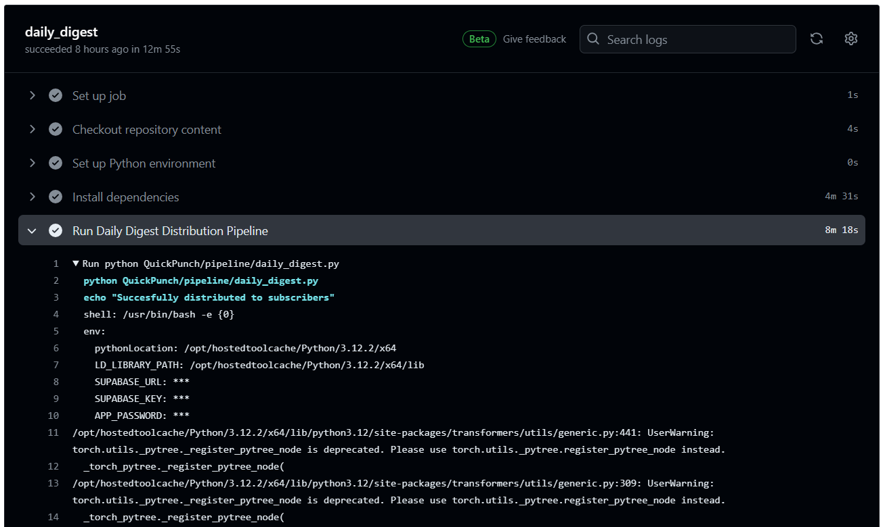

👋🏾

In the developer world, GitHub has become synonymous with code's home base. It's the go-to platform for storing, versioning, and collaborating on code. But GitHub's capabilities extend far beyond simple repositories. 

Over the years, GitHub has matured into the most popular cloud-based Git platform, with a staggering 56% of developers using it professionally and a whopping 87% leveraging it for personal projects. 

What might not be immediately apparent is that GitHub offers a wealth of features beyond just pushing and pulling code. One such powerful feature is 
GitHub Codespaces. This cloud-hosted development environment lets you spin up an instant virtual machine with customizable resources (2-32 cores, 8-64 GB RAM, and up to 128 GB storage) pre-loaded with your repository. Say goodbye to tedious environment setups for short-lived coding projects! 

Epic right? I know! But that's not even the focus of this article.

## Enter GitHub Actions 

What exactly is GitHub Actions?

> Automate, customize, and execute your software development workflows right in your repository with GitHub Actions. You can discover, create, and share actions to perform any job you'd like, including CI/CD, and combine actions in a completely customized workflow.

Now, if that sounded like mumbo jumbo, let's embark on a more practical journey. We'll explore how to automate a workflow using GitHub Actions for a real-world application.

This application scrapes news daily from PunchNG's RSS feed, summarizes the articles using a fine-tuned BERT model, and then sends the summaries to subscribed users' emails. 

Visit [QuickPunch](https://quick-punch.vercel.app)



I built a pipeline to automate this process, but the challenge remained: how to ensure the pipeline runs consistently every morning? 

```bash
$ python  QuickPunch/pipeline/daily_digest.py
```

Manually running the pipeline at 8 AM every day simply wasn't sustainable. There has to be a way to automate this - and this is where GitHub Actions comes into play!

Start by creating a yaml file in the following directory.



On to the fun part: configuring the workflow run. The provided image highlights the key components of the workflow configuration, but the official documentation offers a comprehensive guide for exploring the various options available.

See more: [GitHub Actions Documentation](https://docs.github.com/en/actions)



Now let's break down the labeled parts.
1. **Workflow Name**: Give your workflow a descriptive name. You can even define multiple workflows using separate YAML files.
2. **Trigger Event**: This determines what initiates the workflow run. Common triggers include pull requests, pushes, or schedules. In this example, we utilize a cron job set to 0 8 * *, which corresponds to 8 AM UTC (9 AM WAT). This ensures our workflow executes automatically every morning.
3. **Runner Operating System**: This specifies the operating system used by the virtual machine provisioned by GitHub to run the workflow jobs. Options include Ubuntu, Windows, and more.
4. **Job Steps**: Define multiple steps within a job to organize the workflow execution. Each step has a name, payload, and configuration options. Here, we import external actions that extend our workflow's functionality. 4 allows us to access all files within the repository on the virtual machine.
5. **5** sets up the Python environment needed for our project.
6. **Additional Setups**: Include any extra steps required to run your code, such as installing dependencies using pip (package installer for Python).
7. **Environment Variables**: GitHub Actions lets you securely store sensitive information like API keys within your repository secrets. You can then access these secrets using the provided syntax within your workflow.
8. **Running the Script**: Finally, we specify the command that triggers the actual pipeline execution for daily news summary distribution. 

Finally, save your yaml file and head over to the Actions tab to see all your workflow runs.

---

Phew! That covered a lot of ground. However, as Hamel H. points out, memorizing the syntax isn't necessary. In fact, it's actually better to avoid memorization to prevent errors.



Clicking on a run reveals its detailed execution log and you can just watch it go....



And voila! QuickPunch subscribers can now confidently expect their daily digest delivered every morning, ensuring they stay informed right from the start of their day.